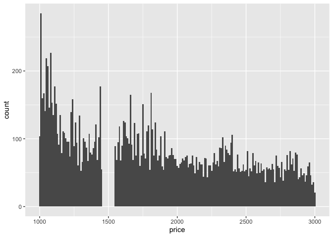
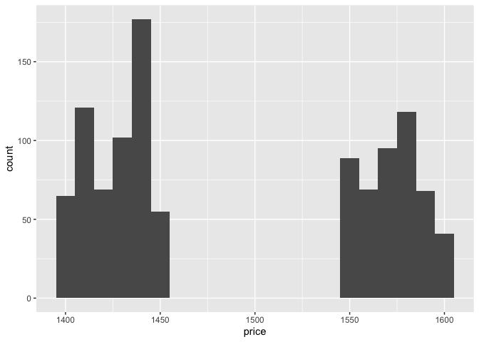
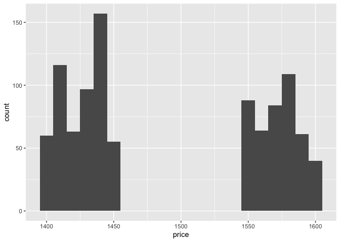
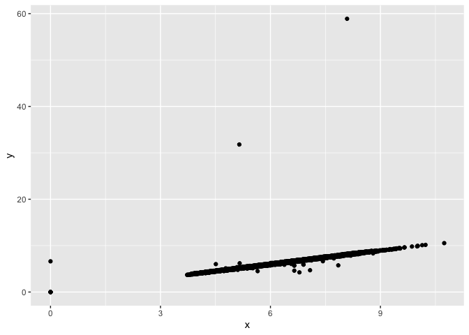

<!-- README.md is generated from README.Rmd. Please edit that file -->

# datadist

<!-- badges: start -->

<!-- badges: end -->

The goal of datadist is to …

## Installation

You can install the development version of datadist from
[GitHub](https://github.com/) with:

``` r
# install.packages("pak")
pak::pak("nlharms414/datadist")
#> ℹ Loading metadata database
#> ✔ Loading metadata database ... done
#> 
#> 
#> → Will install 3 packages.
#> → Will update 1 package.
#> → Will download 1 package with unknown size.
#> + datadist   0.1.0 → 0.1.0 👷🏻‍♀️🔧 ⬇ (GitHub: 7b3903f)
#> + generics           0.1.4 
#> + lubridate          1.9.5 🔧
#> + timechange         0.4.0 🔧
#> ℹ Getting 1 pkg with unknown size, 3 (1.94 MB) cached
#> ✔ Cached copy of datadist 0.1.0 (source) is the latest build
#> ✔ Installed datadist 0.1.0 (github::nlharms414/datadist@7b3903f) (32ms)
#> ✔ Installed generics 0.1.4  (59ms)
#> ✔ Installed lubridate 1.9.5  (68ms)
#> ✔ Installed timechange 0.4.0  (73ms)
#> ✔ 1 pkg + 3 deps: upd 1, added 3 [3.5s]
```

## Example

This is a basic example which shows you how to solve a common problem:

``` r
library(datadist)
## basic example code
```

### Diamonds Data from kaggle

The object `kgl_diamonds` contains five data of the 320 data sets
available on kaggle when searching the platform for `diamonds` (Feb
2026).

At a first glance, the dimensions of these datasets are similar to each
other, but not identical.

``` r
data("kgl_diamonds")
kgl_diamonds |> purrr::map(.f = dim)
#> $`shivam2503/diamonds`
#> [1] 53940    11
#> 
#> $`lovishbansal123/diamond-dataset`
#> [1] 53940    11
#> 
#> $`vittoriogiatti/diamondprices`
#> [1] 53940    10
#> 
#> $`nancyalaswad90/diamonds-prices`
#> [1] 53943    11
#> 
#> $`amirhosseinmirzaie/diamonds-price-dataset`
#> [1] 50000    10
```

The dimensions are also very similar to the `diamonds` dataset in
`ggplot2`:

``` r
library(ggplot2)
library(dplyr)
#> 
#> Attaching package: 'dplyr'
#> The following objects are masked from 'package:stats':
#> 
#>     filter, lag
#> The following objects are masked from 'package:base':
#> 
#>     intersect, setdiff, setequal, union
dim(diamonds)
#> [1] 53940    10
```

Are some of these datasets identical to the `diamonds` data?

``` r
kgl_diamonds |> purrr::map(.f = function(x) identical(x,diamonds))
#> $`shivam2503/diamonds`
#> [1] FALSE
#> 
#> $`lovishbansal123/diamond-dataset`
#> [1] FALSE
#> 
#> $`vittoriogiatti/diamondprices`
#> [1] FALSE
#> 
#> $`nancyalaswad90/diamonds-prices`
#> [1] FALSE
#> 
#> $`amirhosseinmirzaie/diamonds-price-dataset`
#> [1] FALSE
```

When we look a bit closer, though, we find that “vittoriogiatti” has
strong similarities to the `diamonds` data in ggplot2, as all of the
names of the variables coincide and the numeric values are the same,
even in the same order.

``` r
summary(kgl_diamonds[[3]] - diamonds)
#>      carat     cut           color         clarity            depth  
#>  Min.   :0   Mode:logical   Mode:logical   Mode:logical   Min.   :0  
#>  1st Qu.:0   NA's:53940     NA's:53940     NA's:53940     1st Qu.:0  
#>  Median :0                                                Median :0  
#>  Mean   :0                                                Mean   :0  
#>  3rd Qu.:0                                                3rd Qu.:0  
#>  Max.   :0                                                Max.   :0  
#>      table       price         x           y           z    
#>  Min.   :0   Min.   :0   Min.   :0   Min.   :0   Min.   :0  
#>  1st Qu.:0   1st Qu.:0   1st Qu.:0   1st Qu.:0   1st Qu.:0  
#>  Median :0   Median :0   Median :0   Median :0   Median :0  
#>  Mean   :0   Mean   :0   Mean   :0   Mean   :0   Mean   :0  
#>  3rd Qu.:0   3rd Qu.:0   3rd Qu.:0   3rd Qu.:0   3rd Qu.:0  
#>  Max.   :0   Max.   :0   Max.   :0   Max.   :0   Max.   :0
```

This is the same picture we get when we calculate the marginal distances
between all pairs of variables between the two datasets:

``` r
wasserstein <- numdist(kgl_diamonds[[3]], diamonds)
round(wasserstein, 2)
#>       carat depth table price    x    y    z
#> carat  0.00  0.77  0.60  0.21 0.46 0.08 0.09
#> depth  0.77  0.00  0.08  0.21 0.71 0.71 0.74
#> table  0.60  0.08  0.00  0.21 0.54 0.54 0.57
#> price  0.21  0.21  0.21  0.00 0.21 0.21 0.21
#> x      0.46  0.71  0.54  0.21 0.00 0.00 0.07
#> y      0.08  0.71  0.54  0.21 0.00 0.00 0.04
#> z      0.09  0.74  0.57  0.21 0.07 0.04 0.00
#> attr(,"dfa")
#> [1] "kgl_diamonds[[3]]"
#> attr(,"dfb")
#> [1] "diamonds"
```

We see 0s on the diagonal, indicating that these pairs of variables have
the same marginal distribution, i.e. these variables have identical
data. We also see that the difference between `x` and `y` is very small,
indicating a high positive correlation between these two measurements,
i.e. most diamonds are highly symmetric.

data error: y = 58.9 no diamonds priced between \$1460 and \$1540

``` r
diamonds |> filter(between(price, 1000, 3000)) |> ggplot(aes(x = price)) + geom_histogram(binwidth=10)
```



This matrix can be summarized in a score calculated as the minimum of
the sum of all possible variable to variable mappings:

``` r
dscore(wasserstein)$score
#> NULL
```

A value of 0 in this `dscore` indicates that all variables in the
datasets have identical marginal distributions.

Datasets with an additional variable have the row numbers saved in a
first column:

``` r
wasserstein_1 <- numdist(kgl_diamonds[[1]], diamonds)
round(wasserstein_1, 2)
#>       carat depth table price    x    y    z
#> X      0.50  0.50  0.50  0.43 0.50 0.50 0.50
#> carat  0.00  0.77  0.60  0.21 0.46 0.08 0.09
#> depth  0.77  0.00  0.08  0.21 0.71 0.71 0.74
#> table  0.60  0.08  0.00  0.21 0.54 0.54 0.57
#> price  0.21  0.21  0.21  0.00 0.21 0.21 0.21
#> x      0.46  0.71  0.54  0.21 0.00 0.00 0.07
#> y      0.08  0.71  0.54  0.21 0.00 0.00 0.04
#> z      0.09  0.74  0.57  0.21 0.07 0.04 0.00
#> attr(,"dfa")
#> [1] "kgl_diamonds[[1]]"
#> attr(,"dfb")
#> [1] "diamonds"
```

They are, however, identical to each other:

``` r
wasserstein_12 <- numdist(kgl_diamonds[[1]], kgl_diamonds[[2]])
round(wasserstein_12, 2)
#>          X carat depth table price    x    y    z
#> X     0.00  0.50  0.50  0.50  0.43 0.50 0.50 0.50
#> carat 0.50  0.00  0.77  0.60  0.21 0.46 0.08 0.09
#> depth 0.50  0.77  0.00  0.08  0.21 0.71 0.71 0.74
#> table 0.50  0.60  0.08  0.00  0.21 0.54 0.54 0.57
#> price 0.43  0.21  0.21  0.21  0.00 0.21 0.21 0.21
#> x     0.50  0.46  0.71  0.54  0.21 0.00 0.00 0.07
#> y     0.50  0.08  0.71  0.54  0.21 0.00 0.00 0.04
#> z     0.50  0.09  0.74  0.57  0.21 0.07 0.04 0.00
#> attr(,"dfa")
#> [1] "kgl_diamonds[[1]]"
#> attr(,"dfb")
#> [1] "kgl_diamonds[[2]]"
```

More interestingly, the number of observations in `kgl_diamonds` data
sets 4 and 5 are different from the original.

``` r
wasserstein_4 <- numdist(kgl_diamonds[[4]], diamonds)
wasserstein_5 <- numdist(kgl_diamonds[[5]], diamonds)
```

Are these maybe submissions that used the script to update the data?

``` r
kgl_diamonds[[4]] |> filter(between(price, 1400, 1600)) |> ggplot(aes(x = price)) + geom_histogram(binwidth=10)
```



``` r

kgl_diamonds[[5]] |> filter(between(price, 1400, 1600)) |> ggplot(aes(x = price)) + geom_histogram(binwidth=10)
```



Alas, no.

``` r
kgl_diamonds[[5]] |> ggplot(aes(x = x, y = y)) + geom_point()
```



# Comparison of character/categorical variables

Different situations: comparison of numeric to categorical - not sure
how, later

categorical to categorical (lowish number of categories):

``` r
full_x <- kgl_diamonds[[5]]$cut |> as.factor() |> ecdf()

table_x <- kgl_diamonds[[5]]$cut |> table() |> ecdf()
# gives different ecdfs because of different orderings


wassersteinXY(kgl_diamonds[[5]], diamonds)
#> [1] NA


# option 0: count all non-matching strings (for some string distance) (needs the same number of observations)
char_dist <- sum(kgl_diamonds[[1]]$cut != sample(diamonds$cut))/length(kgl_diamonds[[1]]$cut)

# option 1: use dummy encoding (0/1 data.frames) then use datadist on those data frames
dfA <- data.frame(model.matrix(~cut-1, data = kgl_diamonds[[5]]))
dfB <- data.frame(model.matrix(~cut-1, data = diamonds))

dfA$name <- "A"
dfB$name <- "A"
```

Idea for categorical distances:

1.  check if X is equal to Y (only works for the same number of
    observations)
2.  use dummy encoding for X and Y and run numscore
